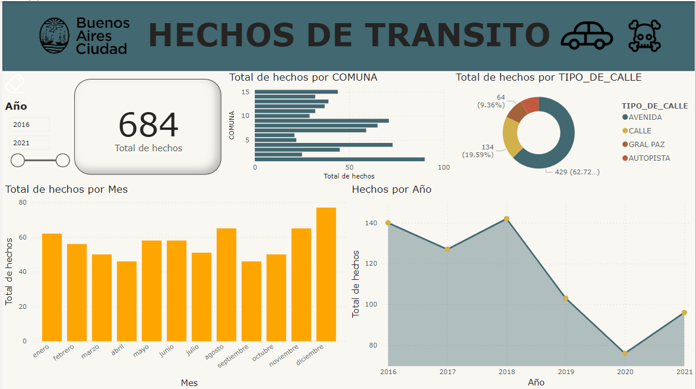

# Data Analytics Siniestros Viales (Buenos Aires, AR.)
Repositorio donde se incluye el proyecto de análisis de datos enfocado en siniestros viales en la ciudad de Buenos Aires, Argentina.
## Descripción del Problema
Los siniestros viales, conocidos como accidentes de tráfico, son eventos en vías públicas que involucran vehículos y pueden causar daños y lesiones. En una ciudad densamente poblada como Buenos Aires, estos incidentes representan una preocupación significativa debido al alto tráfico y la seguridad de los residentes y visitantes. Las tasas de mortalidad por siniestros viales son indicadores cruciales de seguridad vial y reducirlas es esencial. La prevención incluye educación vial, normas de tráfico, infraestructura segura y vehículos seguros, todo respaldado por seguimiento estadístico y políticas efectivas.
## ETL/EDA
Se hizo un ETL para obtener los datasets sin las columnas que no ocupabamos y poder tratarlo en el EDA de forma un poco más sencilla.  
Se utilizaron herramientas de EDA automatico como Y-Profiling para ahorrarnos un poco de tiempo, analizando datos faltantes y buscando datos repetidos.  
## DASHBOARD EN POWER BI
 
Se realizó el dashboard en PowerBI, la primera página nos describe a grandes rasgos la parte de los siniestros, la segunda página nos sirve para ver dónde y con cuanta frecuencia ocurren accidentes en los lugares del mapa, la tercera página nos deja ver la visualización de datos de la víctimas, terminando con la página cuatro, la cual nos deja ver la visualización de los KPI's.
## KPI's
se realizaron 3 KPI'S:  
1.- Reducción en un 10% la tasa de homicidios en siniestros viales de los últimos seis meses  
2.- Reducción en un 7% la cantidad de accidentes mortales de motociclistas en el último año, en CABA, respecto al año anterior  
3.- Reducción en un 15% los accidentes viales en las Avenidas con respecto al año pasado  
(este último siendo mi propuesta de KPI)
## Conclusiones
Si bien, los siniestros se encuentran a la baja, se encuentra un repunte en ultimo año proporcionado; parece curioso que los lugares donde más siniestros son en las avenidas y no en los cruces como podríamos llegar a pensar (lo cual nos habla de poca educación víal), habría que reforzar las acciones para movilidad y observación en estas.  
Los accidentes fatales en moto superan por mucho lo que se esperaba del KPI, por lo que se recomienda implementar nuevas medidas a los motociclistas (tanto de EPP como de movilidad).
